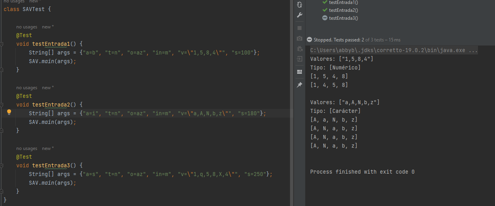
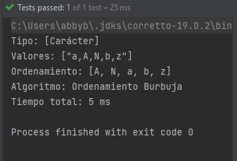
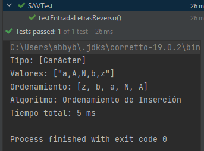

# Capstone SAV

## Explicación breve...

Capstone Sorting Algorithm Viewer, es un proyecto que contiene algoritmos de ordenamiento.
El objetivo final será mostrar de manera gráfica el comportamiento de cada uno de ellos, que aunque el resultado final sea el mismo,
dependerá de cada tipo de ordenamiento el procedimiento o el "camino a seguir" para lograr un arreglo ordenado.

Los algortimos que presenta mi proyecto son:

- InsertionSort: Comienza con una lista de un solo elemento y luego, en cada paso, inserta un nuevo elemento en su posición correcta en la lista ordenada, desplazando los elementos mayores si es necesario.

- BubbleSort: Recorre repetidamente una lista, compara elementos adyacentes y los intercambia si están en el orden incorrecto. Este proceso se repite hasta que la lista esté completamente ordenada.

- SelectionSort: Busca el elemento más pequeño (o más grande) en cada iteración y lo coloca en la posición correcta en la lista. Repite este proceso para todos los elementos, construyendo así la lista ordenada.

## Tests

Los parámetros entran por la terminal del sistema.

***